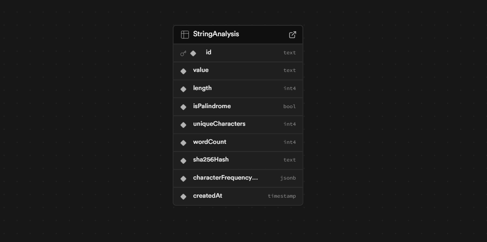

# String Analysis API

A RESTful API service that analyzes strings and stores their computed properties.

## Setup

1. Install dependencies:
   ```bash
   yarn install
   ```

2. Start the database:
   ```bash
   npx prisma dev
   ```

3. Run migrations:
   ```bash
   npx prisma migrate dev --name init
   ```

4. Generate Prisma client:
   ```bash
   yarn prisma:generate
   ```

5. Start the server:
   ```bash
   yarn dev
   ```

## API Endpoints

### POST /strings
Analyze and store a new string.

**Request:**
```json
{
  "value": "string to analyze"
}
```

**Response (201):**
```json
{
  "id": "sha256_hash",
  "value": "string to analyze",
  "properties": {
    "length": 16,
    "is_palindrome": false,
    "unique_characters": 12,
    "word_count": 3,
    "sha256_hash": "abc123...",
    "character_frequency_map": { "s": 2, ... }
  },
  "created_at": "2025-08-27T10:00:00Z"
}
```

### GET /strings/{string_value}
Retrieve a specific string by its value.

### GET /strings
List all strings with optional filters.

Query params: `is_palindrome`, `min_length`, `max_length`, `word_count`, `contains_character`

### GET /strings/filter-by-natural-language
Filter strings using natural language queries.

Example: `?query=all single word palindromic strings`

### DELETE /strings/{string_value}
Delete a string by its value.

## Technologies
- Node.js
- TypeScript
- Express
- Prisma
- PostgreSQL
- Compromise (NLP)

## Database Schema

### StringAnalysis Table



**Schema Details:**
- **Primary Key**: `id` (SHA-256 hash of the string value)
- **Unique Constraint**: `id` ensures no duplicate strings
- **JSON Field**: `characterFrequencyMap` stores character frequency as key-value pairs
- **Auto-timestamp**: `createdAt` is automatically set on record creation

**Table Structure:**
```
┌─────────────────────┐
│   StringAnalysis    │
├─────────────────────┤
│ id (String)         │ ← Primary Key, Unique
│ value (String)      │ ← The input string
│ length (Int)        │ ← String length
│ isPalindrome (Bool) │ ← Palindrome check
│ uniqueCharacters(Int│ ← Count of unique chars
│ wordCount (Int)     │ ← Number of words
│ sha256Hash (String) │ ← SHA-256 hash
│ characterFrequency..│ ← JSON frequency map
│ createdAt (DateTime)│ ← Auto-generated
└─────────────────────┘
```
